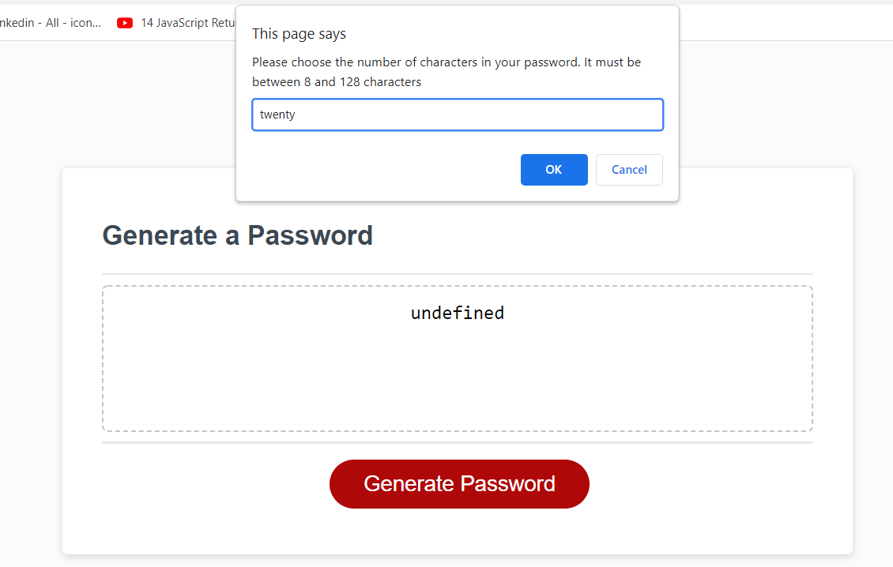

# Password Generator with User Prompts

This week’s assignment looked at applying further Javascript coding to the provided starter code to create an application in a browser to generate random passwwords based on set password criteria. The password generator will included prompts that will ask the user to choose a password length, and agree to the use of upper and lower case letters, special characters and numbers in the password generated. 

## Installation

The profile can be accessed through my GitHub Reposity via the following link:

// https://github.com/Nafisa06/Nafisa-s-Developer-Profile.git 

The following link can be used to view the website on the browser:

 // file:///C:/Users/asifa/bootcamp/homework/Nafisa-s-Developer-Profile/index.html#About%20Me

 ## Usage

 The first window that comes up allows the user to dictate the number of characters they would like in their new password.

 
    

The subsequent windows allow the user to choose additonal features of their password.

    ![screenshot two] (Asset/images/ password prompt 2.png)
    ![screenshot two] (Asset/images/ password prompt 3.png)
    ![screenshot two] (Asset/images/ password prompt 4.png)
    ![screenshot two] (Asset/images/ password prompt 5.png)

## License
Licensed under the [MIT License](MIT License.md)